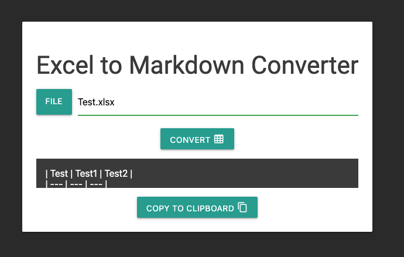

# Excel to Markdown Converter

This is a simple client-side web application that allows you to convert an Excel document to a Markdown table. It was created by [ChatGPT](https://openai.com/blog/chatgpt/) with the help of the following libraries and frameworks:
- [Materialize CSS](https://materializecss.com/) for the design and layout
- [Material Design Icons](https://materialdesignicons.com/) for the icons
- [xlsx.js](https://github.com/SheetJS/xlsx) for reading and converting the Excel document

## How it works

1. Select an Excel file using the file input field.
2. Click the "Convert" button to process the file.
3. The application will read the file, convert the data to a JSON object, and then generate a Markdown table.
4. The Markdown table will be displayed in a textarea, where you can copy the table to your clipboard by clicking the "Copy to clipboard" button

## Note

Please make sure that you include the correct libraries and paths in your project if you are going to use this code.
